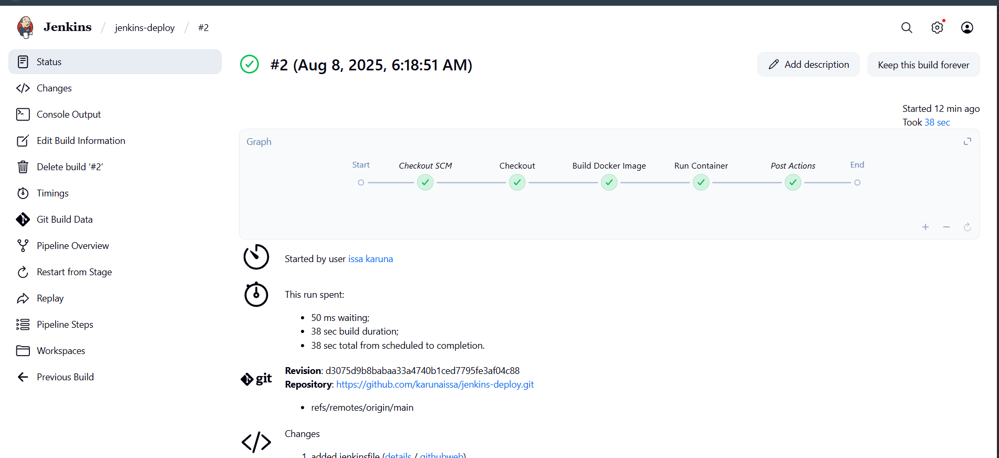

# Jenkins + Docker Pipeline (Simple & Exact)

This setup builds and runs a Flask app using Docker and Jenkins, triggered automatically by GitHub webhooks.

**How it works:**

- A Flask app is **dockerized** using the `Dockerfile`. The container exposes port `5000`.
- Jenkins pipeline is defined in a `Jenkinsfile`, with clear stages:
  - **Build**: Builds the Docker image (`flask-app:latest`)
  - **Run**: Stops and removes any running container, then runs a new instance on port 5000
- A **GitHub webhook** is set up to notify Jenkins whenever code is pushed.
- Jenkins automatically picks up changes, runs the pipeline, and redeploys the container.

---

## Docker Commands (explained)
# Build the image from Dockerfile
docker build -t flask-app:latest .

# Stop and remove any existing container (ignore errors if none exist)
docker stop flask-app || true
docker rm flask-app || true

# Run the container in detached mode, exposing Flask app on port 5000
docker run -d -p 5000:5000 --name flask-app flask-app:latest

### Jenkins Pipeline Stages

Here's what a completed Jenkins pipeline run looks like:

